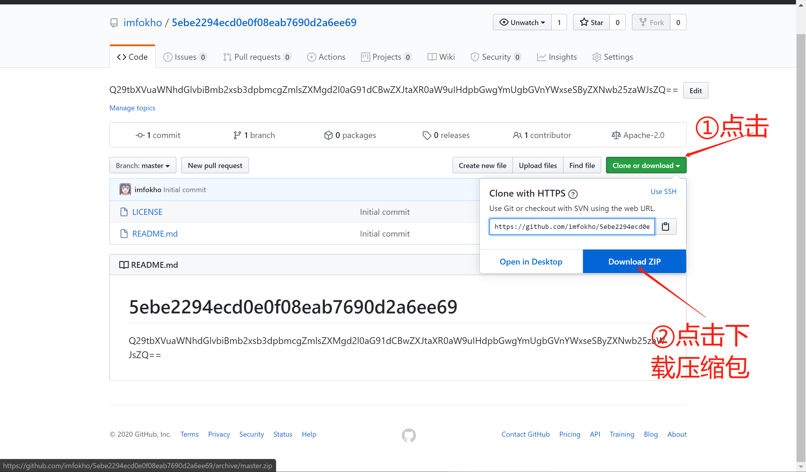

# 5ebe2294ecd0e0f08eab7690d2a6ee69
Q29tbXVuaWNhdGlvbiBmb2xsb3dpbmcgZmlsZXMgd2l0aG91dCBwZXJtaXR0aW9uIHdpbGwgYmUgbGVnYWxseSByZXNwb25zaWJsZQ==

## 使用条件

---

[注册Github需要指导](https://imfokho.github.io/posts/signupgithubtutorial/)

使用文档需要你输入特定的密码，这个密码需要你`Follow`imfokho并`Star`此项目后将自己的信息递交给imfokho验证后（发微信给我）方可使用密码。

**本项目建立在`Apache License 2.0`协议的基础上不允许私自分发、转阅、转载，除非经过本人批准。**

成果来之不易，请尊重这小小的条件。

## 使用说明

---

### 方案一（压缩包下载法）

经过漫长的等待后，你将下载完成，输入密码后即可。

### 方案二（使用Git）

懂的都懂

`git clone https://github.com/imfokho/5ebe2294ecd0e0f08eab7690d2a6ee69.git`

---

## 遇到问题

如果遇到什么问题，欢迎在issues上发布问题。

## 另外

---

此文档只提供借鉴参考，请在使用后丢弃，如出现任何后果由使用者自己承担。

